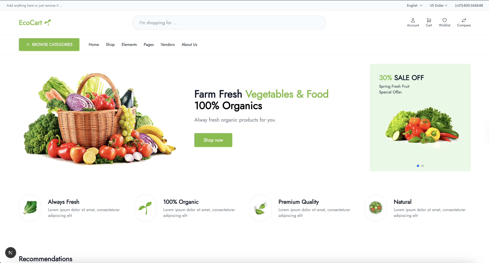
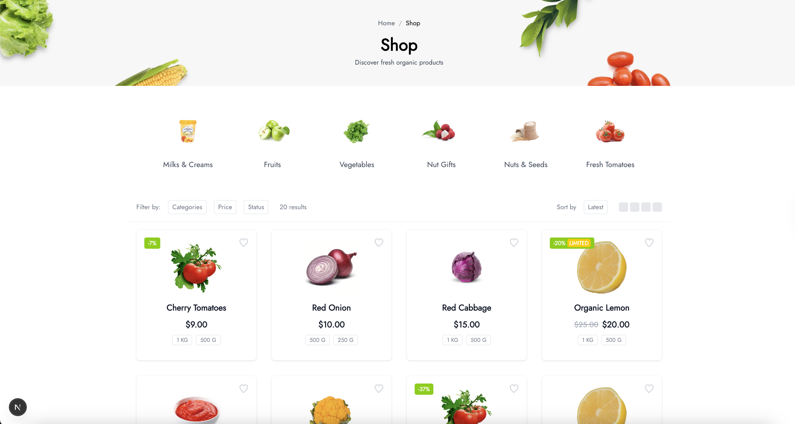
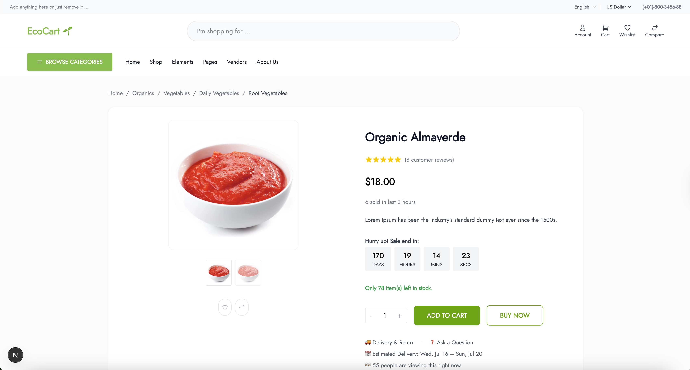
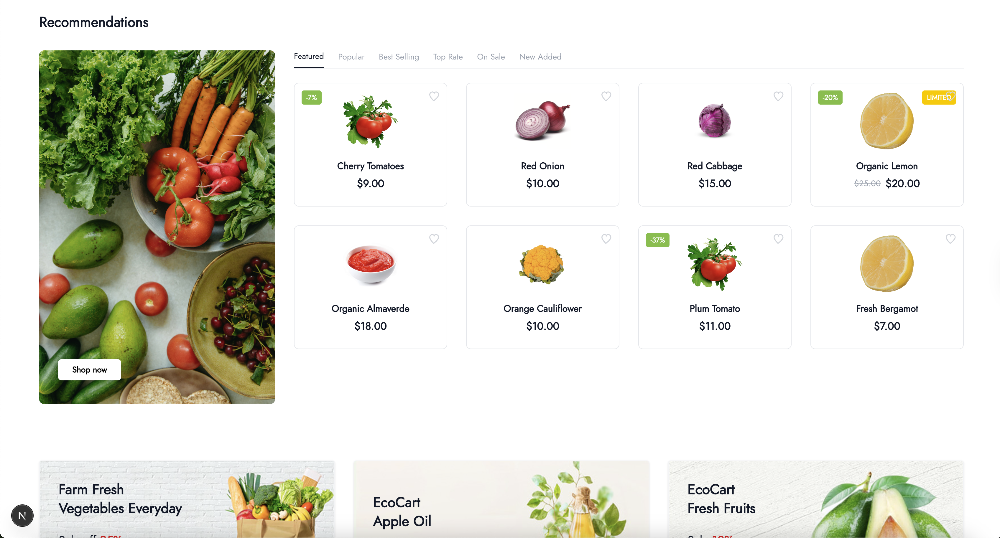

# EcoCart

> **A modern, organic food e-commerce template built with Next.js, React, and Tailwind CSS.**

- **Live Demo:** _coming soon_
- **Website:** [https://your-ecocart-demo.com](https://your-ecocart-demo.com)
- **Topics:** nextjs, react, tailwindcss, ecommerce, organic, food, shop, template, modern-ui

EcoCart is a modern, clean, and customizable e-commerce web application focused on organic food and grocery shopping. Built with Next.js and React, it provides a beautiful shopping experience with a responsive product grid, detailed product pages, and a fresh, organic design.

## Features

- 🌱 **Modern Organic Food E-commerce UI**
- 🛒 **Product Grid with Categories, Filters, and Pagination**
- 📦 **Dynamic Product Detail Pages**
- 🖼️ **Beautiful Category and Product Images**
- 🔍 **Search, Sort, and Browse Categories**
- 🧩 **Reusable Components (Header, Footer, etc.)**
- ⚡ **Fast, Responsive, and Mobile-friendly**
- 🛠️ **Easy to Customize and Extend**

## Tech Stack
- [Next.js](https://nextjs.org/) (App Router)
- [React](https://react.dev/)
- [Tailwind CSS](https://tailwindcss.com/)
- [TypeScript](https://www.typescriptlang.org/)

## Getting Started

### 1. Clone the Repository
```bash
git clone https://github.com/your-username/ecocart.git
cd ecocart
```

### 2. Install Dependencies
```bash
npm install
# or
yarn install
```

### 3. Run the Development Server
```bash
npm run dev
# or
yarn dev
```

Visit [http://localhost:3000](http://localhost:3000) to view the app.

## Project Structure

```
EcoCart/
  src/
    app/
      shop/
        [id]/page.tsx      # Product detail page (dynamic)
        page.tsx           # Shop grid/listing page
      layout.tsx           # App layout (header/footer)
    components/
      HomeHeader.tsx       # Main header/navigation
      Footer.tsx           # Footer
      Navbar.tsx           # (Optional) Navbar component
    ...
  public/                  # Static assets/images
  README.md
```

## Usage
- **Shop Page:** `/shop` — Browse all products, filter by category, and paginate.
- **Product Detail:** `/shop/[product-name]` — Click any product to view its details.
- **Header/Footer:** Consistent across all pages for a seamless experience.

## Customization
- **Add/Edit Products:** Update the `products` array in `shop/page.tsx` and `shop/[id]/page.tsx`.
- **Change Categories:** Update the `categories` array in `shop/page.tsx`.
- **Styling:** Modify Tailwind classes or add your own styles for a unique look.
- **Components:** Reuse or extend components in `src/components/` for new features.

## Screenshots






## License

This project is open source and available under the [MIT License](LICENSE).

---

**EcoCart** — Your modern, organic e-commerce starter!
